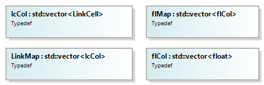
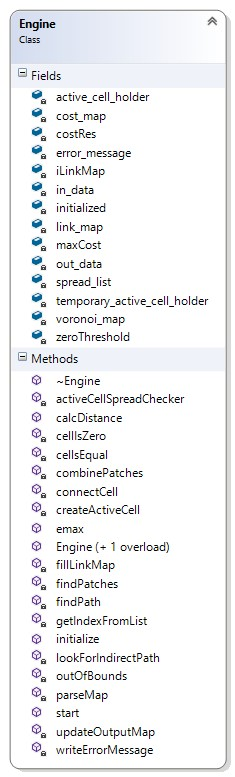
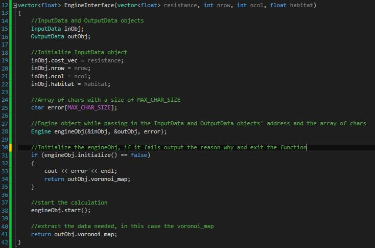

```{r setup, include=FALSE}
knitr::opts_chunk$set(echo = TRUE)
```

# Overview

## Terminologies

- *Cell:* A box or element in a map.
- *Active Cell:* A type of cell that is currently being evaluated.
- *Time:* This could mean iterations. Time is used due to Andrew Fall's use of the term in his forest fire analogy.
- *Object:* An instance of a certain data type, class, or data structure (*i.e.*, `Cell c`, `c` then is an object of type `Cell`).

-----

## Data Structures

- `Cell`: stores its own position (row and column) and an ID.
- `ActiveCell`: inherits the properties of a `Cell` and has its own properties such as `distance`, `originCell`, `parentCell`, `resistance`, and `time` (or iterations). This type of cell is used to keep track of which cells are currently being evaluated. 
- `LinkCell`: inherits the properties of a `Cell` and has its own properties such as `cost`, `distance`, `fromCell`, and `originCell`. This type of cell is used to create `LinkMap`.


- `ActiveCellHolder`: a type of container that stores a vector of `ActiveCell`s in an order.
- `ActiveCellQueue`: contains an `ActiveCellHolder`. Its main purpose is to properly store the `ActiveCellHolder` in a vector in an order, increasing Euclidian distance.
- `InputData`: contains all the data that is needed for the engine to operate. The user of the engine has to create an instance of it and initialize all the properties before giving the address of the object to the engine's constructor.
- `Link`: stores all the links (directly and indirectly) between the patches. Links are given a negative ID to distinguish them from patch IDs. 
- `OutputData`: similar to `InputData` but it acts as a container for all the data that are calculated by the engine and gives that data to the user. 
- `Patch`: a patch or a cluster are the habitats that are found in the resistance map, given a value for habitat. 


-----

## Type Definitions

- `lcCol`: a vector of `LinkCells`.
- `LinkMap`: a vector of `lcCols`, which in turn creates a `Map`. This type stores the connections between cells.
- `flCol`: a vector of floating point values. 
- `flMap`: a vector of `flCol`, which in turn creates a `Map` that contains floating point values in each element or cell.



-----

## The `Engine` Class

The main calculator of the program.
It creates the minimum planar graph (MPG) using the MPG algorithm, finds least cost links or paths, and finds patches or clusters.



### Fields/Properties

**Property**                     | **Data Type**             | **Description**
---------------------------------|---------------------------|----------------------------------
`in_data`                        | InputData Pointer     | Points to an `InputData` object. This is where the engine gets all the initialization values from.
`out_data`                       | OutputData Pointer    | Points to an `OutputData` object. The engine stores all the calculated values in this variable.
`maxCost`                        | float                 | The maximum resistance or cost in the resistance map.
`costRes`                        | float                 | The minimum resistance or cost in the resistance map.
`active_cell_holder`             | ActiveCellQueue       | Holds or stores all the `ActiveCells`.
`temporary_active_cell_holder`   | ActiveCellQueue       | Similar to `active_cell_holder`, except it acts as an intermediate or temporary holder of `ActiveCells`. Required for vector resizing and comparing.
`spread_list`                    | vector of ActiveCells | Stores all the `ActiveCells` that are ready to spread to all 4 adjacent cells, if possible.
`iLinkMap`                       | LinkMap               | A map that keeps track of all the connections between cells due to the spreading and queuing functions.
`voronoi_map`                    | flMap                 | A map that contains floating point values, it stores the voronoi boundaries/polygons.
`cost_map`                       | flMap                 | A map that contains the resistance or cost in each cell/element.
`error_message`                  | Char Pointer          | Stores the erorr messages that occur in the engine. It acts as a way to diagnose problems in the engine.

### Methods/Functions

#### Public Functions

These are the functions that are visible to the user.  

**Function**        | **Return Type**               | **Input Arguments**               | **Description**
--------------------|-------------------------------|-----------------------------------|--------------------------
`Engine`            | Instance of an `Engine`       | Nothing                       | Default Engine constructor.
`Engine`            | Instance of an `Engine`       | InputData Pointer, OutputData Pointer, Char Pointer | Engine constructor.
`initialize`        | Boolean                       | Nothing                       | Prepares the engine for calculation.
`start`             | Void                          | Nothing                       | It runs the MPG algorithm.

#### Linking Functions

These functions create the links between cells and finds the least cost (direct or indirect) paths between patches.  

**Function**          | **Return Type**     | **Input Arguments**               | **Description**  
----------------------|---------------------|-----------------------------------|---------------------------
`findPath`            | Void                | LinkCell Pointer, LinkCell Pointer, Vector of Links | Finds the least cost path between two patches.
`connectCell`         | Void                | ActiveCell Pointer, Integer, Integer, Float | Connects the child cell to the parent cell.
`parseMap`            | Cell                | LinkCell, Link | Given a starting Cell it follows the connections until it reaches a patch. The last cell in the connection is returned.
`lookForIndirectPath` | Void                | Vector of Links, Link   | Tries to find an indirect link and updates the second argument.

#### Patch Finding Functions

The functions are responsible for finding the patches or clusters in a resistance map, given a value for a habitat.  

**Function**        | **Return Type**     | **Input Arguments**         | **Description**  
--------------------|---------------------|-----------------------------|---------------------------
`findPatches`       | Vector of Patches   | Int, Int, Float             | Finds all the patches in the resistance map given the value of the habitat.
`getIndexFromList`  | Int                 | Float, Vector of Patches    | Finds the index in the vector of patches that the given ID correspond to.
`combinePatches`    | Int                 | Int, Int, Vector of Patches | Given two indeces and the list of patches. Extract the two patches from the list and combine those two into one patch. Insert the new patch into the list and return the index value of the new patch. 

#### Common Functions

Common functions are almost used in almost all of the functions in the engine.   

**Function**    | **Return Type**     | **Input Arguments**           | **Description**  
----------------|---------------------|-------------------------------|---------------------------
`outOfBounds`   | Bool                | Int, Int, Int, Int            | Checks to see if the given row and column is still within the resistance map's dimensions.
`cellIsEqual`   | Bool                | Cell, Cell                    | Compares the two cells' row and column if they match.

#### Static Functions
Static functions are functions that can be used without delcaring an object of the class.   

**Function**      | **Return Type**     | **Input Arguments**               | **Description**
------------------|---------------------|-----------------------------------|-----------------------
`emax`            | Float               | Vector of Floats  | Finds the maximum value from the vector of floating point values
`emin`            | Float               | Vector of Floats  | Finds the minimum value from the vector of floating point values
`calcDistance`    | Float               | Cell, Cell        | Finds the eucledian distance between two Cells

-----

# General MPG Algorithm

The MPG algorithm has the following steps:  

1. Create Active Cells.
2. Check if the Active Cells are ready to spread.
3. Spread to all 4 adjacent cells for all the Active Cells that ready to spread.
4. The cells that have been recently spread in to become new Active Cells.
5. Repeat.

  

The linking algorithm is embedded within the spreading functions of the MPG algorithm. When an Active Cell spreads a link map creates a connection between the parent Active Cell to the new (child) Active Cell. Linking is assisted by the ActiveCellQueue to find the least cost/resistive paths. 

-----

# How to Use the Engine

1. Create `InputData` and `OutputData` objects.
2. Initialize the `InputData` object's fields.
3. Create an array of `Char` with the length of `MAX_CHAR_SIZE` or a larger value.
4. Create an `Engine` object and give the address of the `InputData` and `OutputData` objects and the address of the `Char` array as arguments.
5. Call the initialization function from the `Engine` object.
6. If the initialization is successful, call the start function from the `Engine` object. If the initialization is not successful, the array of char will contain the reason for the initialization failure.
7. Once the engine is doen calculating, extract all the fields needed in the `OutputData` object.

A snippet C++ code is attached below as an example:


