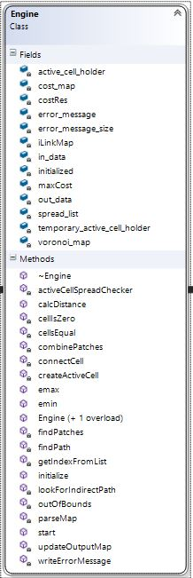

```{r setup, include=FALSE}
knitr::opts_chunk$set(echo = TRUE)
```
# Overview
## Terminologies
* Cell - A box or element in a map
* Active Cell - A type of cell that is currently being evaluated
* Time - this could mean iterations. Time is used due to Andrew Fall's use of the term in his forest fire analogy
* Object - an instance of a certain data type, class, or data structure. (i.e. Cell c, c then is an object of type Cell)

------------------

## Data Structure
* Cell - stores its own position (row and column) and an ID.
* ActiveCell - it inherits the properties of a Cell and has its own properties such as distance, originCell, parentCell, resistance, and time (or iterations). This type of cell is used to keep track of which cells are currently being evaluated. 
* LinkCell - it inherits the properties of a Cell and has its own properties such as cost, distance, fromCell and originCell. This type of cell is used to create LinkMap.

  

* ActiveCellHolder - it is a type of container that stores a vector of ActiveCells in an order.
* ActiveCellQueue - it contains an ActiveCellHolder. Its main purpose is to properly store the ActiveCellHolder in a vector in an order, increasing eucledian distance.
* InputData - it contains all the data that is needed for the engine to operate. The user of the engine has to create an instance of it and initialize all the properties before giving the address of the object to the engine's constructor.
* Link - it stores all the links (directly and indirectly) between the patches. Links are given a negative ID to distinguish them from patch IDs. 
* OutputData - similar to InputData but it acts as a container for all the data that are calculated by the engine and gives that data to the user. 
* Patch - a patch or a cluster are the habitats that are found in the resistance map, given a value for habitat. 

  

---------------------------------------------

## Type Definitions
* lcCol - a vector of LinkCells. 
* LinkMap - a vector of lcCols which in turn creates a Map. This type stores the connections between cells.
* flCol - a vector of floating point values. 
* flMap - a vector of flCol which in turn creates a Map that contains floating point values in each element or cell. 

  

--------------------------------------------

## Engine Class
The main calculator of the program. It creates the MPG using the MPG algorithm, finds least cost links or paths, and finds patches or clusters.

  

### Fields/Properties
Property                     | Data Type             | Description
-----------------------------|-----------------------|----------------------------------
in_data                      | InputData Pointer     | It points to an InputData object. This is where the engine gets all the initialization values from
out_data                     | OutputData Pointer    | It points to an OutputData object. The engine stores all the calculated values in this variable
maxCost                      | float                 | The maximum resistance or cost in the resistance map
costRes                      | float                 | The minimum resistance or cost in the resistance map
zeroThreshold                | float                 | The error threshold for the floating point zero. This is required due to the behaviour of comparing floating point numbers
active_cell_holder           | ActiveCellQueue       | It holds or stores all the ActiveCells
temporary_active_cell_holder | ActiveCellQueue       | Similar to active_cell_holder, except it acts as an intermediate or temporary holder of ActiveCells. This is required for vector resizing and comparing
spread_list                  | vector of ActiveCells | It stores all the ActiveCells that are ready to spread to all 4 adjacent cells, if possible
iLinkMap                     | LinkMap               | A map that keeps track of all the connections between cells due to the spreading and queuing functions
voronoi_map                  | flMap                 | A map that contains floating point values, it stores the voronoi boundaries/polygons
cost_map                     | flMap                 | A map that contains the resistance or cost in each cell/element
error_message                | Char Pointer          | It stores the erorr messages that occur in the engine. It acts as a way to diagnose problems in the engine


### Methods/Functions
#### Public Functions
These are the functions that is visible to the user.  

Function        | Return Type               | Input Arguments               | Description
----------------|---------------------------|-------------------------------|------------------
Engine          | Instance of an Engine     | Nothing                       | Default Engine constructor
Engine          | Instance of an Engine     | InputData Pointer, OuputData Pointer, Char Pointer, Float (optional, default is 0.0001) | Engine constructor
initialize      | Boolean                   | Nothing                       | Prepares the engine for calculation
start           | Void                      | Nothing                       | It runs the MPG algorithm


#### Linking Functions
These functions create the links between cells and finds the least cost (direct or indirect) paths between patches.  

Function      | Return Type     | Input Arguments               | Description
--------------|-----------------|-------------------------------|-------------------
findPath      | Void            | LinkCell Pointer, LinkCell Pointer, Vector of Links | Finds the least cost path between two patches
connectCell   | Void            | ActiveCell Pointer, Integer, Integer, Float | Connects the child cell to the parent cell
parseMap      | Cell            | LinkCell, Link | Given a starting Cell it follows the connections until it reaches a patch. The last cell in the connection is returned.
lookForIndirectPath | Void      | Vector of Links, Link   | Tries to find an indirect link and updates the second argument

#### Patch Finding Functions
The functions are responsible for finding the patches or clusters in a resistance map, given a value for a habitat.  

#### Common Functions
Common functions are almost used in almost all of the functions in the engine.   


#### Static Functions
Static functions are functions that can be used without delcaring an object of the class.   


--------------------------------------------

# General MPG Algorithm
The MPG algorithm has the following steps:  
1. Create Active Cells  
2. Check if the Active Cells are ready to spread  
3. Spread to all 4 adjacent cells for all the ActiveCells that ready to spread   
4. The cells that have been recently spread in to become new Active Cells  
5. Repeat  

  

The linking algorithm is embedded within the spreading functions of the MPG algorithm. When an Active Cell spreads a link map creates a connection between the parent Active Cell to the new (child) Active Cell. Linking is assisted by the ActiveCellQueue to find the least cost/resistive paths. 

--------------------------------------------

# How to Use the Engine
