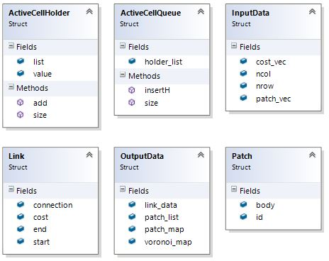

```{r setup, include=FALSE}
library(knitr)

opts_chunk$set(cache = TRUE)
opts_chunk$set(echo = TRUE)
opts_chunk$set(eval = TRUE)
opts_chunk$set(fig.height = 6)
opts_chunk$set(fig.width = 6)
opts_chunk$set(message = FALSE)
opts_chunk$set(results = 'hold')
opts_chunk$set(warning = FALSE)
```

\newpage

## Overview
The Minimum Planar Graph (MPG) is a spatial representation of a mathematical graph or network that is useful for modelling dense two-dimensional landscape networks. It can efficiently approximate pairwise connections between graph nodes, and this can assist in the visualization and analysis of how a set of patches is connected. The MPG also has the useful property that the proximity, size and shape of patches in the network combined with the pattern of resistance presented by the landscape collectively influence the paths among patches and the end-points of those links. In this sense the MPG can be said to be spatially-explicit, and therefore to be a property of the entire landscape under analysis (or alternatively a property of the digital resistance map used to represent the landscape). 

The Minimum Planar Graph (MPG) achieves this spatially-explicit property by finding Voronoi polygons that describe regions of proximity in resistance units around focal patches. The algorithm that is used to find the Voronoi boundaries and approximate the least cost-paths between patches and their end-points is described below.

In `grainscape`, the boundaries of Voronoi polygons are found by using a spreading or marching algorithm. This is done beginning in each perimeter cell of a patch and spreading out to adjacent cells that are not part of any patch and have not been visited yet by the algorithm. These cells are then given a patch ID to mark the Voronoi territory. A Voronoi boundary is found when a cell is visited twice by two different Voronoi territories or IDs originating from different patches.

Using a marching algorithm to find the Voronoi boundaries makes it possible to implement a linking algorithm that can run in parallel with the marching algorithm.
As a cell is spread into (let's call it a child cell) it then creates a link or connection between the child cell and the cell that it spread from, which we call a parent cell.

Finding the least-cost path in this way is only possible because the algorithm stores the child cells (which will eventually become parent cells) in a queuing table that sorts the cells in a certain order. The child cells are sorted by increasing Euclidean distance between the child cell and their origin cell, the perimeter cell that the connection originally spawned from. A link or path between patches is then created at the first Voronoi boundary between two patches. 

The MPG algorithm has the following general steps. These are represented in more detail in a flow chart in Figure 1.

1. Create Active Cells.
2. Check if the Active Cells are ready to spread.
3. Spread to all 4 adjacent cells for all the Active Cells that ready to spread.
4. The cells that have been recently spread in to become new Active Cells.
5. Repeat.

{ height=90% }

The linking algorithm is embedded within the spreading functions of the MPG algorithm. When an Active Cell spreads a link map creates a connection between the parent Active Cell to the new (child) Active Cell. Linking is assisted by the queue when finding the least-cost paths. 

## Technical reference to the MPG engine written in C++

The following is intended to provide an overview of the C++ engine provided by the package that implements the MPG algorithm. It may be useful for those who wish to implement MPG extraction in other programming languages. Reading and interpretation of this section is not required for the use of `grainscape` in R. An interface to this code has been abstracted to R functions using the `Rcpp` package.

### Terminology

- *Cell:* A box or element in a map.
- *Active Cell:* A type of cell that is currently being evaluated. It refers to the child cell mentioned above. 
- *Time:* An index of the iteration.
- *Object:* An instance of a certain data type, class, or data structure (*i.e.*, `Cell c`, `c` then is an object of type `Cell`).

### Data Structures

- `Cell`: stores its own position (row and column) and an ID.
- `ActiveCell`: inherits the properties of a `Cell` and has its own properties such as `distance`, `originCell`, `parentCell`, `resistance`, and `time` (or iterations). This type of cell is used to keep track of which cells are currently being evaluated. 
- `LinkCell`: inherits the properties of a `Cell` and has its own properties such as `cost`, `distance`, `fromCell`, and `originCell`. This type of cell is used to create `LinkMap`.


- `ActiveCellHolder`: a type of container that stores a vector of `ActiveCell`s in an order.
- `ActiveCellQueue`: contains an `ActiveCellHolder`. Its main purpose is to properly store the `ActiveCellHolder` in a vector in an order, increasing Euclidean distance.
- `InputData`: contains all the data that is needed for the engine to operate. The user of the engine has to create an instance of it and initialize all the properties before giving the address of the object to the engine's constructor.
- `Link`: stores all the links (directly and indirectly) between the patches. Links are given a negative ID to distinguish them from patch IDs. 
- `OutputData`: similar to `InputData` but it acts as a container for all the data that are calculated by the engine and gives that data to the user. 
- `Patch`: a patch or a cluster are the habitats that are found in the resistance map, given a value for habitat. 



### Type Definitions

- `lcCol`: a vector of `LinkCells`.
- `LinkMap`: a vector of `lcCols`, which in turn creates a `Map`. This type stores the connections between cells.
- `flCol`: a vector of floating point values. 
- `flMap`: a vector of `flCol`, which in turn creates a `Map` that contains floating point values in each element or cell.


### The `Engine` Class

The main calculator of the program.
It creates the minimum planar graph (MPG) using the MPG algorithm, finds least cost links or paths, and finds patches or clusters.


#### Fields/Properties

**Property**                     | **Data Type**             | **Description**
---------------------------------|---------------------------|----------------------------------
`in_data`                        | InputData Pointer     | Points to an `InputData` object. This is where the engine gets all the initialization values from.
`out_data`                       | OutputData Pointer    | Points to an `OutputData` object. The engine stores all the calculated values in this variable.
`maxCost`                        | float                 | The maximum resistance or cost in the resistance map.
`costRes`                        | float                 | The minimum resistance or cost in the resistance map.
`active_cell_holder`             | ActiveCellQueue       | Holds or stores all the `ActiveCells`.
`temporary_active_cell_holder`   | ActiveCellQueue       | Similar to `active_cell_holder`, except it acts as an intermediate or temporary holder of `ActiveCells`. Required for vector resizing and comparing.
`spread_list`                    | vector of ActiveCells | Stores all the `ActiveCells` that are ready to spread to all 4 adjacent cells, if possible.
`iLinkMap`                       | LinkMap               | A map that keeps track of all the connections between cells due to the spreading and queuing functions.
`voronoi_map`                    | flMap                 | A map that contains floating point values, it stores the Voronoi boundaries/polygons.
`cost_map`                       | flMap                 | A map that contains the resistance or cost in each cell/element.
`error_message`                  | Char Pointer          | Stores the error messages that occur in the engine. It acts as a way to diagnose problems in the engine.

#### Methods/Functions

##### Public Functions

These are the functions that are visible to the user.  

**Function**        | **Return Type**               | **Input Arguments**               | **Description**
--------------------|-------------------------------|-----------------------------------|--------------------------
`Engine`            | Instance of an `Engine`       | Nothing                       | Default Engine constructor.
`Engine`            | Instance of an `Engine`       | InputData Pointer, OutputData Pointer, Char Pointer | Engine constructor.
`initialize`        | Boolean                       | Nothing                       | Prepares the engine for calculation.
`start`             | Void                          | Nothing                       | It runs the MPG algorithm.

##### Linking Functions

These functions create the links between cells and finds the least cost (direct or indirect) paths between patches.  

**Function**          | **Return Type**     | **Input Arguments**               | **Description**  
----------------------|---------------------|-----------------------------------|---------------------------
`findPath`            | Void                | LinkCell Pointer, LinkCell Pointer, Vector of Links | Finds the least cost path between two patches.
`connectCell`         | Void                | ActiveCell Pointer, Integer, Integer, Float | Connects the child cell to the parent cell.
`parseMap`            | Cell                | LinkCell, Link | Given a starting Cell it follows the connections until it reaches a patch. The last cell in the connection is returned.
`lookForIndirectPath` | Void                | Vector of Links, Link   | Tries to find an indirect link and updates the second argument.

##### Patch Finding Functions

The functions are responsible for finding the patches or clusters in a resistance map, given a value for a habitat.  

**Function**        | **Return Type**     | **Input Arguments**         | **Description**  
--------------------|---------------------|-----------------------------|---------------------------
`findPatches`       | Void                | Nothing                     | Finds all the patches in the patch vector and assign patch IDs.
`getIndexFromList`  | Int                 | Float, Vector of Patches    | Finds the index in the vector of patches that the given ID correspond to.
`combinePatches`    | Int                 | Int, Int, Vector of Patches | Given two indices and the list of patches. Extract the two patches from the list and combine those two into one patch. Insert the new patch into the list and return the index value of the new patch. 

##### Common Functions

Common functions are used in almost all of the functions in the engine.   

**Function**    | **Return Type**     | **Input Arguments**           | **Description**  
----------------|---------------------|-------------------------------|---------------------------
`outOfBounds`   | Bool                | Int, Int, Int, Int            | Checks to see if the given row and column is still within the resistance map's dimensions.
`cellIsEqual`   | Bool                | Cell, Cell                    | Compares the two cells' row and column if they match.

##### Static Functions
Static functions are functions that can be used without declaring an object of the class.   

**Function**      | **Return Type**     | **Input Arguments**               | **Description**
------------------|---------------------|-----------------------------------|-----------------------
`emax`            | Float               | Vector of Floats  | Finds the maximum value from the vector of floating point values
`emin`            | Float               | Vector of Floats  | Finds the minimum value from the vector of floating point values
`calcDistance`    | Float               | Cell, Cell        | Finds the Euclidean distance between two Cells

\newpage

### How to Use the Engine

1. Create `InputData` and `OutputData` objects.
2. Initialize the `InputData` object's fields. Keep in mind that the vectors in the InputData and Output data structures are all of type `float`.
3. Create an array of `Char` with the length of `MAX_CHAR_SIZE` or a larger value.
4. Create an `Engine` object and give the address of the `InputData` and `OutputData` objects, the `Char` array  and the size of the array as arguments.
5. Call the initialization function from the `Engine` object.
6. If the initialization is successful, call the start function from the `Engine` object. If the initialization is not successful, the array of char will contain the reason for the initialization failure.
7. Once the engine is done calculating, extract all the fields needed in the `OutputData` object.

A snippet C++ code is shown on the next page as an example.

Note that the current `Engine` has two lines of code that are meant for interfacing with R.
In order to make the `Engine` run with any programming or scripting language, remove those two lines.
One of them is an `include` statement for `Rcpp`, at the very top of source code, and the other is inside the `start` function, the first line inside the `while` loop.
Those two lines are convenient for R users when they want to interrupt or stop the MPG algorithm safely, without crashing their console and possibly losing their data.

\newpage

```{Rcpp cpp-example, eval = FALSE}
vector<float> EngineInterface(vector<float> resistance, vector<float> patches,
                              int nrow, int ncol)
{
	//InputData and OutputData objects
	InputData inObj;
	OutputData outObj; 

	//Initialize InputData object
	inObj.cost_vec = resistance;
	inObj.nrow = nrow;
	inObj.ncol = ncol;
	inObj.patch_vec = patches;

	//Array of chars with a size of MAX_CHAR_SIZE
	char error[MAX_CHAR_SIZE];

	//Engine object while passing in the InputData and OutputData objects'
	// address and the array of chars
	Engine engineObj(&inObj, &outObj, error, MAX_CHAR_SIZE);

	//Initialize the engineObj;
	//If it fails output the reason why and exit the function
	if (engineObj.initialize() == false)
	{
		cout << error << endl;
		return outObj.voronoi_map;
	}

	//start the calculation
	engineObj.start();

	//extract the data needed, in this case the voronoi_map
	return outObj.voronoi_map;
}
```
